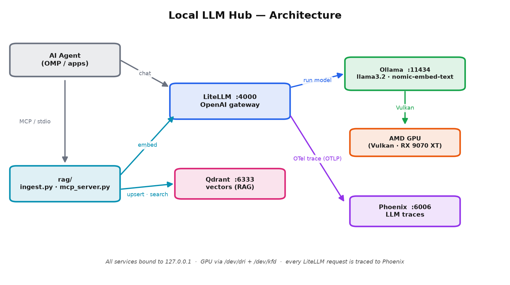

#+title: Local LLM Hub
#+subtitle: Local, containerized AI infrastructure — Ollama + LiteLLM + Qdrant (RAG) + Phoenix (observability)
#+author: Twilight4
#+date: [2026-07-16 Wed]
#+options: toc:3 num:nil ^:nil
#+property: header-args :exports code

Run open-source LLMs locally — portable to any Docker host, with optional
AMD GPU acceleration — behind a single standardized, OpenAI-compatible
API (master-key protected), and give an AI agent a *search tool* over
your own documents via the Model Context Protocol (MCP).
Everything runs in Docker, on =127.0.0.1= only.

* Table of Contents :toc:
- [[#project-overview][Project Overview]]
  - [[#architecture][Architecture]]
  - [[#directory-structure][Directory Structure]]
  - [[#tech-stack][Tech Stack]]
- [[#from-local-to-production-environment-aws-bedrock][From Local to Production Environment (AWS Bedrock)]]
- [[#deploy-infrastructure][Deploy Infrastructure]]
  - [[#prerequisites][Prerequisites]]
  - [[#how-to-deploy][How to deploy]]
  - [[#using-the-api][Using the API]]
  - [[#teardown][Teardown]]
  - [[#troubleshooting][Troubleshooting]]
- [[#retrieval-and-mcp][Retrieval and MCP]]
  - [[#how-it-works][How it works]]
  - [[#index-your-documents][Index your documents]]
  - [[#the-mcp-tool][The MCP tool]]
  - [[#register-in-a-coding-agent][Register in a coding agent]]
  - [[#use-it-from-an-agent][Use it from an agent]]
- [[#observability-with-phoenix][Observability with Phoenix]]
  - [[#how-tracing-works][How tracing works]]
  - [[#view-traces][View traces]]
- [[#testing-in-ci][Testing in CI]]
  - [[#what-the-test-checks][What the test checks]]
  - [[#running-locally][Running locally]]
  - [[#dependency-updates][Dependency updates]]
- [[#roadmap][Roadmap]]

* Project Overview
Five services plus a small retrieval layer:

- *Ollama* — the engine. Downloads and runs the model on the GPU; speaks its own API on port 11434.
- *LiteLLM* — the gateway. Exposes the standard OpenAI API on port 4000 (chat *and* embeddings), translates to Ollama, and enforces a *master API key*.
- *Qdrant* — the vector database. Stores embeddings of your documents for semantic search (port 6333).
- *Phoenix* — LLM observability. Receives a trace of every LiteLLM request over OpenTelemetry (UI on port 6006).
- *Open WebUI* — the chat UI. A ChatGPT-style web frontend on port 8080; routes every chat through LiteLLM (master-key gated, traced) rather than talking to Ollama directly.

On top of those containers, a tiny Python *retrieval layer* (in =rag/=) does two
things: an ingestion script embeds your text into Qdrant, and an *MCP server*
exposes a =search-internal-docs= tool that an AI agent can call to query those
documents.

Why this shape? LiteLLM gives you one stable, OpenAI-compatible front door you
can keep forever while swapping engines behind it; Qdrant + MCP turns the LLM
from "knows its training data" into "knows *your* data" — without retraining.

** Architecture
#+caption: Local LLM Hub — request and tracing flow (every LiteLLM call is traced to Phoenix via OTel).

All ports bind to =127.0.0.1= — nothing is exposed beyond the host.
The web UI ([[http://127.0.0.1:8080][http://127.0.0.1:8080]]) is the browser entry point: sign up (first user becomes admin), pick a model, and chat. Open WebUI routes every request through LiteLLM, so chats hit the same master-key gate and Phoenix tracing as direct API calls — no separate Ollama shortcut.

** Directory Structure
#+begin_example
local-llm-hub/
├── README.org              this file
├── docker-compose.yml      ollama + litellm + qdrant + phoenix, CPU-default, healthchecks
├── docker-compose.gpu.yml  AMD GPU override: /dev/dri + /dev/kfd pass-through (opt-in)
├── docker-compose.ci.yml   CI override: mock Ollama, no GPU, fixed master key
├── litellm_config.yaml     maps model names (llama3.2, nomic-embed-text) to Ollama
├── .env.example            committed template for the master + salt keys
├── .env                    REAL secrets — gitignored, never committed
├── .github/workflows/
│   └── config-test.yml     GitHub Actions: chat-endpoint test on every config change
├── ci/
│   ├── mock_ollama.py      stub Ollama for CI (canned responses, no model/GPU)
│   ├── test_chat.sh        POSTs a chat completion, asserts OpenAI JSON shape
│   └── test_streaming.sh   POSTs a streaming completion, asserts SSE chunks
├── rag/
│   ├── chunking.py         token-aware, heading-aware chunker (pure function; tiktoken)
│   ├── common.py           shared config: Qdrant client, embed() via LiteLLM, collection setup
│   ├── ingest.py           token+heading-aware chunk → embed → upsert (idempotent per file)
│   ├── mcp_server.py       MCP server exposing the `search-internal-docs` tool (stdio)
│   └── test_chunk.py       chunker self-check (uv run rag/test_chunk.py)
└── assets/
    └── architecture.png   the architecture diagram (see Architecture)
#+end_example

** Tech Stack
| Layer           | Tool                        | Version |
|-----------------+-----------------------------+---------|
| LLM engine      | Ollama                      | 0.32.0  |
| Chat model      | Llama 3.2 (3B)              | —       |
| Embedding model | nomic-embed-text (768-dim)  | —       |
| API gateway     | LiteLLM proxy               | v1.92.0 |
| Vector database | Qdrant                      | v1.18.2 |
| Observability   | Phoenix (Arize)             | v18.1.0 |
| Agent↔tool link | Model Context Protocol      | mcp SDK |
| RAG scripts     | Python (uv, PEP-723 inline) | 3.11+   |
| Orchestration   | Docker Compose              | v2      |
| GPU backend (opt.) | Mesa Vulkan (vulkan-radeon) | 26.1.4  |

* From Local to Production Environment (AWS Bedrock)
A single-host Docker Compose stack doesn't map 1:1 to a production cloud-native
deployment. This table shows each local component and its typical AWS
production equivalent. The *LiteLLM* gateway abstraction means only the =model_list= entries
change to swap Ollama for Bedrock (=ollama/*= → =bedrock/*=); the gateway,
RAG, and MCP layers move largely as-is.

| Layer           | Local (this repo)           | AWS production                                |
|-----------------+-----------------------------+-----------------------------------------------|
| LLM inference   | Ollama (Vulkan GPU)         | Amazon Bedrock (managed, no model hosting)    |
| Embeddings      | =nomic-embed-text= via Ollama | Amazon Titan Text Embeddings v2 (Bedrock)     |
| API gateway     | LiteLLM (master key)        | LiteLLM on ECS, or Bedrock native API         |
| Auth            | =.env= master key             | Cognito / API Gateway authorizer + IAM        |
| Vector DB       | Qdrant (single container)   | Amazon OpenSearch (k-NN) or RDS pgvector      |
| Observability   | Phoenix (single container)  | Langfuse Cloud / Datadog LLM Obs / CloudWatch |
| Secrets         | =.env= (gitignored)           | AWS Secrets Manager / Parameter Store (KMS)   |
| Orchestration   | Docker Compose              | Amazon ECS (Fargate) or EKS (Kubernetes)      |
| Document ingest | =rag/ingest.py= (=uv run=)      | Lambda or ECS task triggered by S3 events     |
| MCP transport   | =rag/mcp_server.py= (stdio)   | MCP over HTTP, or AWS Lambda tool             |
| GPU compute     | AMD RX 9070 XT (opt-in)     | Bedrock managed, or Inferentia2 instances     |
| Storage         | Docker named volumes        | EBS (block) + S3 (object/docs)                |
| Networking      | =127.0.0.1= only              | VPC + ALB (ACM-managed TLS)                   |
| CI/CD           | GitHub Actions              | GitHub Actions (OIDC → AWS) or CodePipeline   |

Two things don't change in the move:
- *LiteLLM* stays as the gateway abstraction; only its =model_list= shifts from =ollama/*= to =bedrock/*=.
- *MCP* is transport-agnostic — same =search-internal-docs= tool, just exposed over HTTP instead of stdio.

The real production-isolation work isn't the LLM layer (Bedrock makes that
easy); it's the surrounding infra: auth, VPC networking, TLS, autoscaling,
and backups.

* Deploy Infrastructure
** Prerequisites
- *Docker, native engine.* Default =docker context= is preferred; Docker Desktop's VM-backed runtime doesn't pass the GPU through reliably (only relevant if you use the GPU override below):
  #+begin_src bash
  docker context show    # expect: default
  #+end_src
- *(Optional) AMD GPU + Vulkan driver* (=vulkan-radeon=, part of =mesa=) with =/dev/dri= and =/dev/kfd= present. Without it, the stack runs on CPU (portable, slower). On Garuda/Arch the driver ships by default.
- *Disk:* ~6 GB (images + chat + embedding models + Phoenix).
- *Python tooling:* [[https://github.com/astral-sh/uv][uv]] — a fast Python runner (a single Rust binary, not a pip package); the =rag/= scripts declare deps inline and run via =uv run=.
  #+begin_src bash
  curl -LsSf https://astral.sh/uv/install.sh | sh   # standalone binary (recommended) — or: paru -S uv
  #+end_src

** How to deploy
1. *Create your secrets file* from the template:
   #+begin_src bash
   cd local-llm-hub/
   cp .env.example .env
   #+end_src

2. *Generate the master + salt keys* and paste them into =.env= (prefix each with =sk-=):
   #+begin_src bash
   openssl rand -hex 32     # -> LITELLM_MASTER_KEY=sk-<hex>
   openssl rand -hex 32     # -> LITELLM_SALT_KEY=sk-<hex>
   #+end_src
   =.env= is gitignored — it is never committed.

3. *Start the stack* — CPU by default (portable; works on any Docker host), or apply the GPU override on an AMD host for faster inference:
   #+begin_src bash
   # CPU (default) — portable:
   docker compose up -d

   # AMD GPU (faster; needs the Vulkan driver):
   docker compose -f docker-compose.yml -f docker-compose.gpu.yml up -d
   #+end_src

4. *Wait for all services to be healthy:*
   #+begin_src bash
   docker compose ps       # ollama/litellm/qdrant show (healthy); phoenix shows (Up)
   #+end_src

5. *Download the models* (one-time, persisted in a named volume):
   #+begin_src bash
   docker compose exec ollama ollama pull llama3.2          # chat model (~2 GB)
   docker compose exec ollama ollama pull nomic-embed-text  # embedding model (~270 MB)
   #+end_src
   Note: =llama3.2='s default tag is the 3B model — small and fast.

6. *Test it* — see [[*Using the API][Using the API]].

** Using the API
The gateway is OpenAI-compatible. Authenticate with the master key from =.env=.

*Chat:*
#+begin_src bash
# Positive path — a real completion
curl -s http://127.0.0.1:4000/v1/chat/completions \
  -H "Authorization: Bearer $(grep LITELLM_MASTER_KEY .env | cut -d= -f2)" \
  -H "Content-Type: application/json" \
  -d '{"model":"llama3.2","messages":[{"role":"user","content":"reply with one word: pong"}]}'

# Negative path — wrong key -> HTTP 401
curl -s -o /dev/null -w '%{http_code}\n' http://127.0.0.1:4000/v1/chat/completions \
  -H "Authorization: Bearer wrong" -H "Content-Type: application/json" \
  -d '{"model":"llama3.2","messages":[{"role":"user","content":"hi"}]}'
#+end_src

*Streaming* (chunks arrive as the LLM generates them — like ChatGPT):
#+begin_src bash
curl -N http://127.0.0.1:4000/v1/chat/completions \
  -H "Authorization: Bearer $(grep LITELLM_MASTER_KEY .env | cut -d= -f2)" \
  -H "Content-Type: application/json" \
  -d '{"model":"llama3.2","stream":true,"messages":[{"role":"user","content":"count to 5"}]}'
#+end_src
=-N= disables curl's output buffering so each chunk prints as it arrives. Each line is =data: {chunk-json}=, and the stream ends with =data: [DONE]=.

*Embeddings* (used by the RAG scripts):
#+begin_src bash
curl -s http://127.0.0.1:4000/v1/embeddings \
  -H "Authorization: Bearer $(grep LITELLM_MASTER_KEY .env | cut -d= -f2)" \
  -H "Content-Type: application/json" \
  -d '{"model":"nomic-embed-text","input":"hello world"}' | head -c 120
#+end_src
Expect JSON starting ={"data":[{"embedding":[= — a 768-long vector.

Any OpenAI-compatible client works — point =base_url= at =http://127.0.0.1:4000/v1= and use the master key.

Confirm the GPU is doing the work:
#+begin_src bash
docker compose logs ollama | grep -iE 'gpu|vulkan|amd'    # i.e. AMD Radeon RX 9070 XT (RADV GFX1201)
#+end_src
(Only meaningful when the GPU override is applied; CPU-mode logs show no GPU line.)

** Teardown
#+begin_src bash
docker compose down        # stop + remove containers (keeps the data volumes)
docker compose down -v     # also delete ollama-data + qdrant-data + phoenix-data
#+end_src

** Troubleshooting
- *LiteLLM returns 401 with the right key:* =.env= is missing or the key is mistyped. With no master key set, LiteLLM runs keyless (insecure) — so a mismatch reads as unauthorized, not as "no key".
- *Open WebUI replies with a JSON tool-call blob instead of chatting* (e.g. ={"type":"function","name":"update_task",...}=): Open WebUI injects its builtin tools (tasks, timestamps, knowledge search...) into every chat via a function-calling prompt; small models like =llama3.2= (3B) hallucinate a tool call instead of replying. =DEFAULT_MODEL_METADATA= in the compose disables builtin tools by default (=capabilities.builtin_tools: false=). To re-enable tools for a model that can handle them (8B+), edit per-model capabilities in Admin Panel → Workspace → Models.
- *Ollama is slow:* it's running on CPU — the default, for portability. To use an AMD GPU, apply the override (=docker compose -f docker-compose.yml -f docker-compose.gpu.yml up -d=), then confirm via =docker compose logs ollama | grep -i vulkan=.
- *GPU override fails (=no such file or directory= on =/dev/dri= or =/dev/kfd=):* you're on a host without AMD GPU device nodes. Stay on CPU (default) or move to a host with an AMD GPU + the =vulkan-radeon= driver. NVIDIA needs a different override (see the =docker-compose.gpu.yml= header); not provided.
- =permission denied= *on a render node*: add =group_add: ["video", "render"]= to the =ollama= service (not needed on this host — render nodes are world-writable).
- *Embeddings 404 / model not found:* you forgot =ollama pull nomic-embed-text=, or the =nomic-embed-text= entry is missing from =litellm_config.yaml= (restart litellm after editing).
- *MCP tool doesn't appear:* ensure =uv= is on the *client's* =PATH= (GUI apps often need the absolute =uv= path from =command -v uv=), the script path is absolute, and =.env= is readable (=LITELLM_MASTER_KEY=). Full per-client setup in [[#register-in-a-coding-agent][Register in a coding agent]].

* Retrieval and MCP
Turn the LLM from "knows its training data" into "knows your documents" via RAG.
The =rag/= scripts embed your text into Qdrant and expose a search tool over MCP.

** How it works
#+begin_example
1. ingest.py      reads text → token+heading-aware chunks → embeds via LiteLLM → upserts (idempotent per file) into Qdrant
2. mcp_server.py  exposes `search-internal-docs(query, source_contains?, section_contains?)`:
                    embeds the query → searches Qdrant for the closest chunks → returns them (optional source/section filters)
3. the AI agent   calls that tool (over MCP/stdio) whenever it needs your docs
#+end_example
Both scripts share =rag/common.py=, which holds the Qdrant client, an =embed()=
helper (calls LiteLLM =/v1/embeddings= → Ollama =nomic-embed-text=), and the
collection setup. Dependencies are declared inline per script (PEP-723), so
=uv run <script>= resolves them automatically — no venv management.

Collection: =internal-docs=, 768-dimensional, cosine similarity (matches nomic-embed-text).

** Index your documents
#+begin_src bash
uv run rag/ingest.py README.org            # one file
uv run rag/ingest.py ./some-docs-dir       # or a directory of .org / .md / .txt
#+end_src
Expect: =Ingested N chunks from M file(s) into 'internal-docs'=. Re-running is idempotent (per-file clobber).

Inspect visually in the Qdrant dashboard: http://127.0.0.1:6333/dashboard.

** The MCP tool
=rag/mcp_server.py= is a stdio MCP server (built with the official =mcp= SDK / FastMCP) exposing one tool:

- *search-internal-docs* = (query: str, limit: int = 4, source_contains?: str, section_contains?: str) → str :: embeds =query= and returns the top matching passages (with source + section) from Qdrant. Optional =source_contains= / =section_contains= narrow the search to a file-path or heading substring.

** Register in a coding agent
The server is identical for every client — each just spawns =uv run rag/mcp_server.py=; only the *config file and key* differ. Use bare =uv= (it must be on the client's =PATH= — see gotchas) and the *absolute* path to the script (replace =/path/to/local-llm-hub= below).

*Standard block* — OMP, Claude Code, Claude Desktop, Cursor, Cline, Continue, Windsurf, Gemini CLI (merge =qdrant-docs= into the existing =mcpServers= object):
#+begin_src json
{
  "mcpServers": {
    "qdrant-docs": {
      "command": "uv",
      "args": ["run", "/path/to/local-llm-hub/rag/mcp_server.py"]
    }
  }
}
#+end_src

Where each client looks for it:

| Client              | Config file                                                                                              | Key               |
|---------------------+----------------------------------------------------------------------------------------------------------+-------------------|
| OMP (oh-my-pi)      | =~/.omp/agent/mcp.json=                                                                                  | =mcpServers=      |
| Claude Code         | =<project>/.mcp.json= (or =claude mcp add=)                                                              | =mcpServers=      |
| Claude Desktop      | =~/.config/Claude/claude_desktop_config.json=                                                            | =mcpServers=      |
| Cursor              | =<project>/.cursor/mcp.json=                                                                             | =mcpServers=      |
| Cline (VS Code)     | =~/.config/Code/User/globalStorage/saoudrizwan.claude-dev/settings/cline_mcp_settings.json=              | =mcpServers=      |
| Continue            | =~/.continue/config.json=                                                                               | =mcpServers=      |
| Windsurf            | =~/.codeium/windsurf/mcp_config.json=                                                                    | =mcpServers=      |
| Gemini CLI          | =~/.gemini/settings.json=                                                                               | =mcpServers=      |
| VS Code (Copilot)   | =<project>/.vscode/mcp.json=                                                                             | =servers=         |
| Zed                 | =~/.config/zed/settings.json=                                                                            | =context_servers= |

*Claude Code one-liner* (from the project root — no manual JSON):
#+begin_src bash
claude mcp add qdrant-docs -- uv run "$(pwd)/rag/mcp_server.py"
#+end_src

*VS Code / Copilot variant* (=.vscode/mcp.json=) — note the =servers= key and the =type= field:
#+begin_src json
{
  "servers": {
    "qdrant-docs": {
      "type": "stdio",
      "command": "uv",
      "args": ["run", "/path/to/local-llm-hub/rag/mcp_server.py"]
    }
  }
}
#+end_src

*Zed variant* (=~/.config/zed/settings.json=) — =command= is nested under =context_servers=:
#+begin_src json
{
  "context_servers": {
    "qdrant-docs": {
      "command": {
        "path": "uv",
        "args": ["run", "/path/to/local-llm-hub/rag/mcp_server.py"]
      }
    }
  }
}
#+end_src

*Gotchas:*
- GUI app reports =uv not found=: apps launched from the dock/app launcher (Claude Desktop, Cursor, VS Code, Windsurf) inherit a minimal =PATH= and can't see =uv=. Fix: use the *absolute* binary path (=command -v uv=, e.g. =~/.local/bin/uv=) in place of bare =uv=.
- *Config not picked up:* most clients read MCP config only at startup — fully quit and reopen the app (VS Code: *Developer: Reload Window*).
- *Tool missing after registering:* run the server by hand to see the error:
  #+begin_src bash
  uv run rag/mcp_server.py    # should start silently, waiting on stdin
  #+end_src
  Usually =.env= is missing =LITELLM_MASTER_KEY=, or the =litellm= / =qdrant= containers aren't running.

** Use it from an agent
In any agent session (OMP, Claude Code, Cursor, …), ask something grounded in your indexed docs, e.g.:
#+begin_quote
"What GPU backend does this project use, and why? Use search-internal-docs."
#+end_quote
The agent calls the tool, retrieves the relevant passages from Qdrant, and answers from your documents.

* Observability with Phoenix
Every request through LiteLLM is traced in [[https://github.com/Arize-ai/phoenix][Phoenix]] — open-source, self-hosted LLM observability in a *single container* — via OpenTelemetry. Inspect prompts, responses, token counts, latency, and estimated cost per call.

** How tracing works
#+begin_example
LiteLLM ── success_callback: ["otel"] ──OTLP/HTTP──▶ Phoenix :6006/v1/traces
#+end_example
- =litellm_config.yaml= sets =success_callback: ["otel"]=.
- =docker-compose.yml=, on the =litellm= service: =OTEL_EXPORTER_OTLP_ENDPOINT=http://phoenix:6006= and =OTEL_EXPORTER_OTLP_PROTOCOL=http/protobuf=.
- Phoenix v18 ingests OTLP at =http://phoenix:6006/v1/traces= (it shares the web port; 4318 is *not* used).
- Traces persist in Phoenix's embedded SQLite (the =phoenix-data= volume); auth is off (=PHOENIX_ENABLE_AUTH=false=) for local single-user use.

** View traces
Open http://127.0.0.1:6006 in a browser → *Traces*. Make any request and a new trace appears (model, input, output, tokens, latency):
#+begin_src bash
curl -s http://127.0.0.1:4000/v1/chat/completions \
  -H "Authorization: Bearer $(grep LITELLM_MASTER_KEY .env | cut -d= -f2)" \
  -H "Content-Type: application/json" \
  -d '{"model":"llama3.2","messages":[{"role":"user","content":"hello"}]}'
#+end_src

* Testing in CI
Every change to the LiteLLM config, the compose files, =.env.example=, or
the test infrastructure itself triggers a GitHub Actions workflow
(=.github/workflows/config-test.yml=) that brings the stack up against a
*mock Ollama* and asserts a chat completion returns valid OpenAI JSON.

The mock exists because the real engine needs an AMD GPU and multi-GB
model pulls — neither is available on a hosted CI runner. =ci/mock_ollama.py=
is an ~80-line stdlib HTTP server that speaks just enough of Ollama's
native API (=/api/generate=, =/api/chat=, =/api/tags=, =/api/show=,
=/api/embeddings=) for LiteLLM's =ollama/*= provider to route through it
and return canned, deterministic output.

** What the test checks
=ci/test_chat.sh= POSTs a chat completion to LiteLLM and asserts:
1. The response parses as JSON with =choices[0].message.content= as a string.
2. The content matches the mock's deterministic reply (=ok=).

What this guards: YAML errors, broken =model_list=, missing master-key
env, wrong ports, removed services, malformed response shape. What it
does *not* guard: real model output (nondeterministic; out of scope for CI).

** Running locally
#+begin_src bash
# stop the real stack first — same container names + port 4000 conflict
docker compose down

# bring up the CI variant: mock ollama, no qdrant/phoenix
docker compose -f docker-compose.yml -f docker-compose.ci.yml up -d \
    --wait --scale qdrant=0 --scale phoenix=0 --scale open-webui=0

./ci/test_chat.sh
./ci/test_streaming.sh

# tear down without -v to keep model volumes intact
docker compose -f docker-compose.yml -f docker-compose.ci.yml down

# restore the real stack
docker compose up -d
#+end_src

The CI workflow uses =down -v= (clean state per run); locally, omit =-v=
so the multi-GB model volumes survive the test.

** Dependency updates
=.github/dependabot.yml= opens weekly PRs (Monday) bumping the
digest-pinned Docker images and GitHub Actions. Every Dependabot PR
triggers the chat test above; =.github/workflows/dependabot-auto-merge.yml=
auto-merges on green CI and leaves failures open for manual review.
Requires "Allow auto-merge" enabled in repo Settings → General → Pull Requests.

* Roadmap
- [X] Infrastructure Setup (Docker Compose)
- [X] API Gateway & Routing (LiteLLM)
- [X] RAG: Qdrant vector DB + nomic-embed-text embeddings
- [X] MCP integration: =search-internal-docs= tool for agent document search
- [X] Observability: Phoenix tracing via LiteLLM's OTel callback.
- [X] Pin image tags by digest for bit-for-bit reproducibility.
- [X] CI: GitHub Actions runs the chat-endpoint test on every config change.
- [X] Dependabot: weekly Docker image + GitHub Actions bumps, auto-merge on green CI.
- [X] Streaming responses: =stream: true= support for chat completions.
- [X] RAG: token-aware chunking + Qdrant metadata filters (=source=, =section=) for better retrieval.
- [X] Web UI: Open WebUI container pointed at LiteLLM for chat from a browser ([[http://127.0.0.1:8080][http://127.0.0.1:8080]]; first signup = admin).
- [ ] Kubernetes: package the five-service stack as a Helm chart under =deploy/helm/=.
- [ ] GitOps: ArgoCD =Application= auto-syncs the chart from =main= to the cluster.
- [ ] Platform observability: =kube-prometheus-stack= + LiteLLM/Ollama =ServiceMonitors= + Grafana dashboards.
